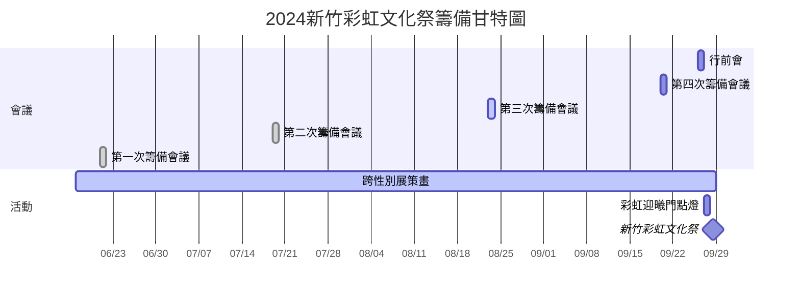
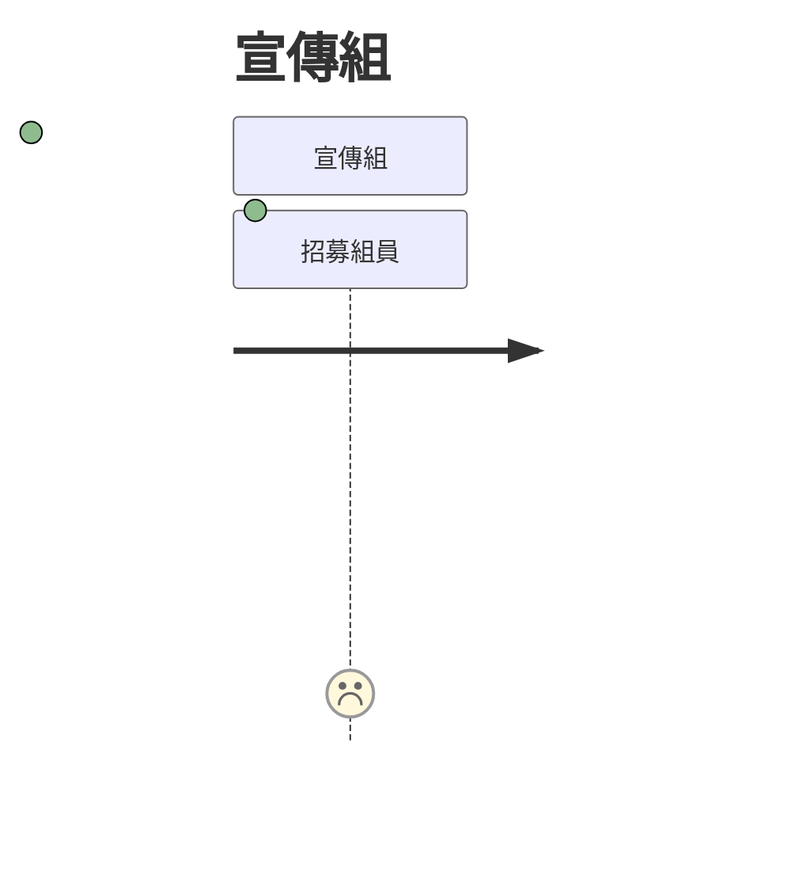
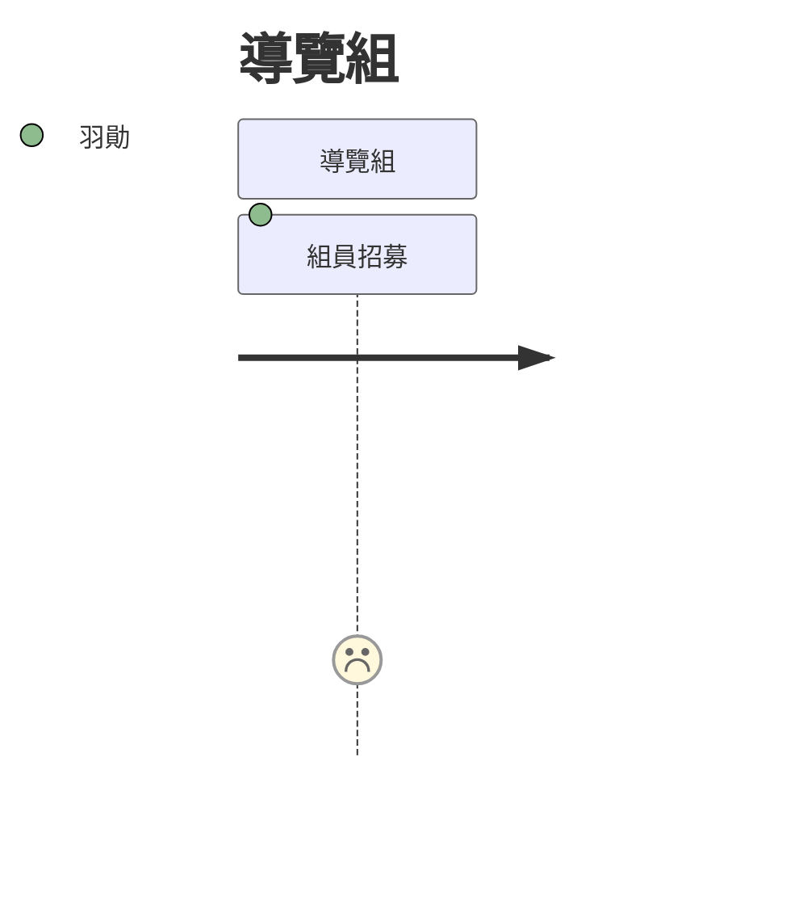
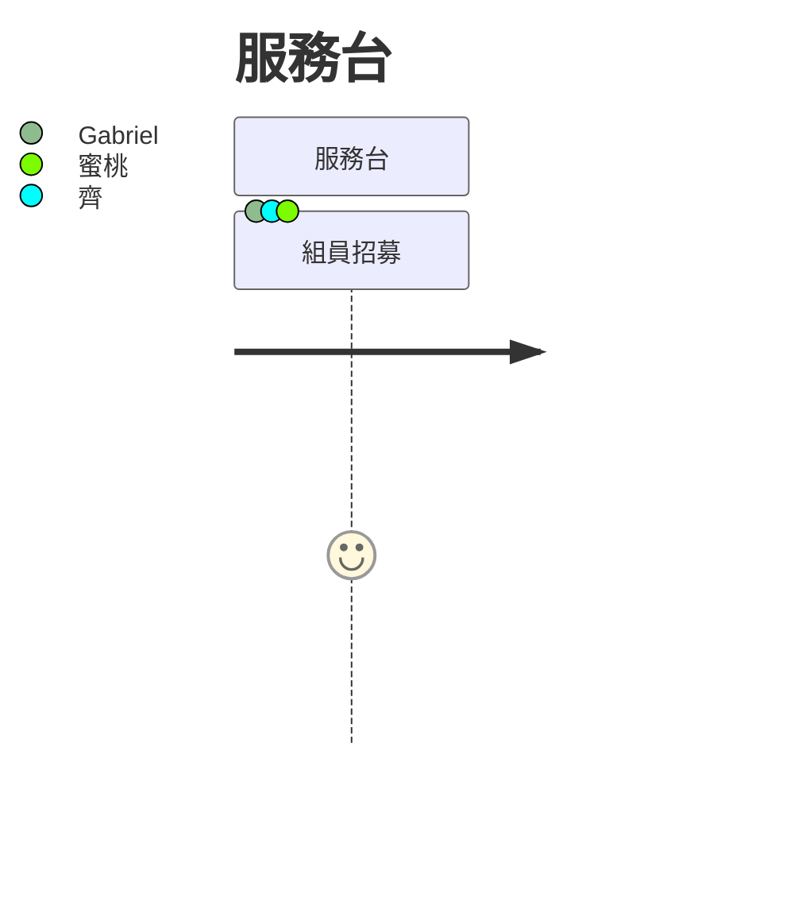
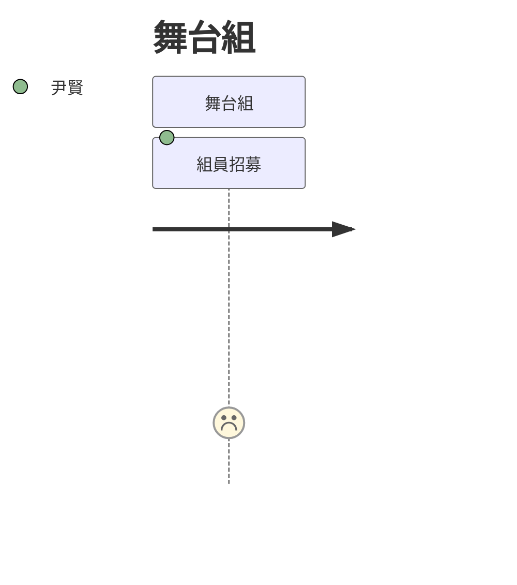
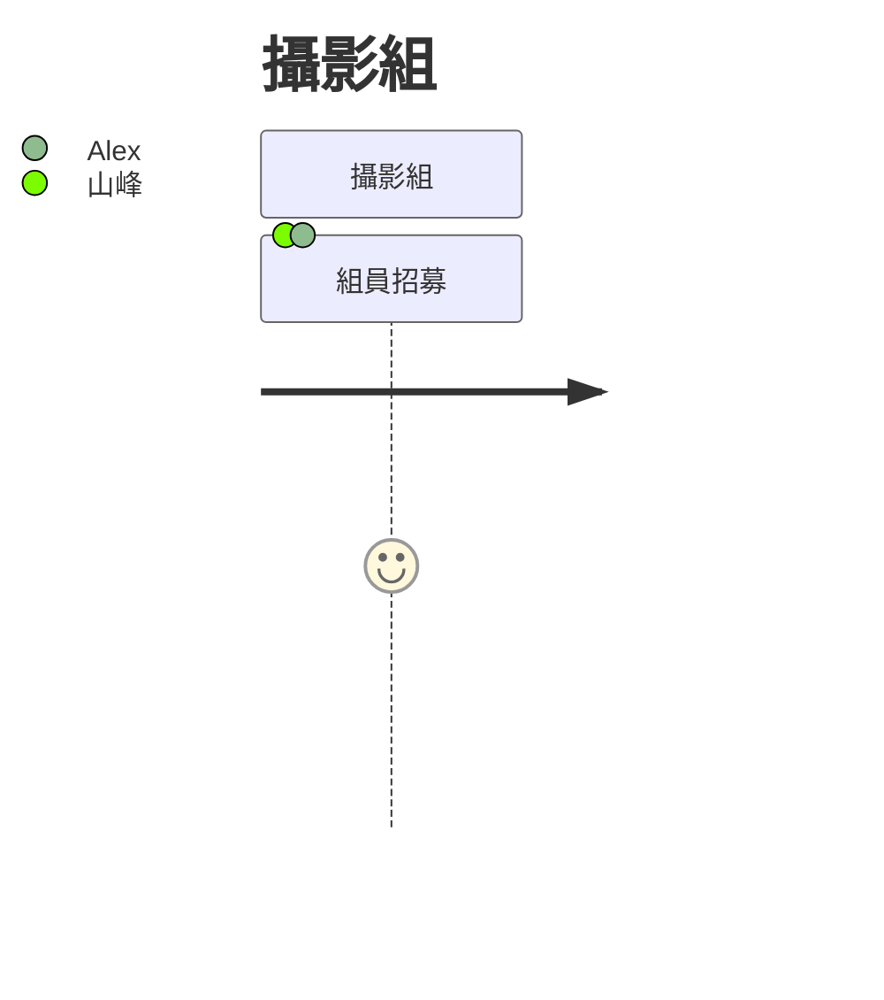

# 新竹彩虹文化祭籌備會議

:::info

> 標籤: `風城部屋` `新竹彩虹文化祭` `財團法人紅絲帶基金會`
:::

----

## 總攬

:::info

- 當前任務的進度更新。
<!--請在journey section填上「項目:進度1-5的評級:成員」-->
:::

> [name=Harold] 待新增攤商與街頭藝人報名期限。

----

### 備註

::: spoiler
<!--請輸入待討論的內容-->

:::

---

## 第二次籌備會議

:::info

- **地點:** 風城部屋多功能活動空間
- **時間:** 七月 19, 2024 7:00 PM (UTF+8)
- **議程**

1. 2024新竹彩虹文化祭活動細項 `40min` [name=Molly]
2. 互動與遊戲發想 `30min`
3. 分組與動議 `10min`

:::spoiler

- **出席:**
  - 茉莉 [name=Molly]
  - 華育 [name=Hana]
  - 雅芙 [name=Yafu]
  - 祺0
  - 山峰
  - 昊昊 [name=Harold]
- **秘書:** [name=Hana] <hana@taiwanaids.org.tw>
- **主席:** [name=Molly]
- **參照:** [meeting minute](/s/template-meeting-note)

:::

----

### 2024新竹彩虹文化祭活動細項

- [活動細項簡報](<https://www.canva.com/design/DAGLNcVeO6o/66O_qoCgGV7lC3AvmKgYfQ/edit?utm_content=DAGLNcVeO6o&utm_campaign=designshare&utm_medium=link2&utm_source=sharebutton>)

----

### :dart: 目標

- 確認上次會議待決議內容
  - 已確定場地中得使用飲料募款。
  - 由於沒有更好的提案，保留星空電影院活動。
  - 由於經費與環境保護考量，互動以遊戲取代原先便利貼的提案，留言互動移至參與展覽的其他形式。

----

### :books: 內容

- 募款
  - 募款飲料選定OOHA氣泡飲（待確定供應商的多元友善評分）。
- 佈置
  - 以跨性別展為中心發散，用5條各760公分的露營燈串連結到攤商帳。
  - 攤位時間延長至晚上，確認與電影活動不衝突，需要請攤商自備照明用具。

----

### :mag: 規劃

#### 攤位

:::warning

- ==餘3== 公部門 **4攤**
    :::spoiler
      2. 新竹市衛生局Mpox防治宣導站
    :::
:::
- 私部門 **12攤**
  - 非政府組織 **5攤**
    :::spoiler
        1. 風城部屋篩檢站
        4. 桃園療養院
        6. 台大醫院新竹院區
        8. 聯新國際醫院反毒教育資源中心
        15. 風城部屋服務台
    :::
:::warning
  - ==餘1== 其他 **7攤**
    :::spoiler
        3. 森林貓小舖
        5. 一起搖尾巴吧
        7. 小羊說故事
        9. 毛孩的彩虹天堂
        16. 紅商店
        19. 錦熠堂
    :::
:::

----

#### 表演

- 彥峰
- 清大吉他社
- J-tour busker

----

#### 贊助

- 桃園療養院
- 台大醫院新竹院區
  - 風城部屋x台大醫院聯名布章
- 毛孩的彩虹天堂
  - 毛孩的彩虹天堂贊助活動紀念衣

----

#### 實習

:::info

- 7/18開工

:::

- 暖蛇青少年共學團
  - 友善店家組 **8名**
  - 展覽創作組 **10名**

----

#### 動議

##### 遊戲討論

----

- 性／別骰骰看
  - 擲骰子決定性別認同／性徵／性取向情境讓民眾表達自身反應的遊戲。
  - 像是「小孩是『順性別』『女』『同性戀』」時，會有的三個想法。

----

- 保險套大賽
  - 比賽將保險套套在假屌的速度。

----

- 街頭訪問
  - 訪問民眾對多元性別的觀點。

----

- 洞察共畫
  - 使用五個限定意義的符號讓民眾作畫自身對「做最好的陪伴」的想法，完成的畫作即時展覽。

----

- 套圈圈
  - 衛生宣導後，讓民眾玩套圈圈套住假屌有獎勵的遊戲。

---

### :closed_book: 任務

:::spoiler
==缺額== / 項目 / **估值**
:::

----

#### 1. 舞台組

:::info

- 協助音控與主持活動。 [name=尹賢]

:::
:::warning

- [ ] ==2== 組員招募 **3名** [name=尹賢]

:::

----

#### 2. 宣傳組

:::info

- 至少4人，指引民眾至會場，機動性支援其他組別。

:::
:::warning

- [ ] ==4== 組員招募 **4名**

:::

----

#### 3. 服務台

:::info

- 至少6人，服務台待命，協助民眾諮詢及醫護。 [name=Gabriel][name=齊][name=蜜桃]

:::
:::warning

- [ ] ==1== 組員招募 **4名** [name=Gabriel][name=齊][name=蜜桃]

:::

----

#### 4. 遊戲組

:::info

- 至少2人，協助互動遊戲進行。

:::
:::warning

- [ ] ==2== 組員招募 **2名**

:::

----

#### 5. 篩檢組

:::info

- 至少2人，須具備篩檢證照。 [name=淳禾]

:::
:::warning

- [ ] ==1== 組員招募 **2名** [name=淳禾]

:::

----

#### 6. 導覽組

:::info

- 至少4人，介紹跨性別展覽並引導動線。 [name=羽勛]

:::
:::warning

- [ ] ==3== 組員招募 **4名** [name=羽勛]

:::

----

#### 7. 攝影組

:::info

- 至少2人，活動照片與影像紀錄。 [name=山峰][name=Alex]

:::
:::success

- [x] 組員 **2名** [name=山峰][name=Alex]

:::

----

### 備註

<!-- Other important details discussed during the meeting can be entered here. -->

---

## 第一次籌備會議

:::info

- **地點:** 風城部屋多功能活動空間
- **時間:** 六月 21, 2024 7:00 PM (UTF+8)
- **議程**

1. 2024新竹彩虹文化祭活動大綱 `45min` [name=Wayne]
2. 分組與動議 `30min`
3. 場地勘查 `30min`

:::spoiler

- **出席:**
  - 韋恩 [name=Wayne]
  - 茉莉 [name=Molly]
  - 華育 [name=Hana]
  - 雅芙 [name=Yafu]
  - 班森 [name=Benson]
  - 昊昊 [name=Harold]

- **秘書:** [name=Hana] <hana@taiwanaids.org.tw>
- **主席:** [name=Wayne]
- **參照:** [meeting minute](/s/template-meeting-note)
:::

----

### 2024新竹彩虹文化祭活動大綱

- [活動大綱簡報](https://www.canva.com/design/DAGIeQDO6rU/-9Jr8lkZh1ItDLMVyizC6Q/edit?utm_content=DAGIeQDO6rU&utm_campaign=designshare&utm_medium=link2&utm_source=sharebutton)

----

### :dart: 目標

- 2024第十四屆彩虹文化祭「做自己最好的陪伴」

----

### :books: 內容

- 定番活動
  - 彩虹迎曦門
  - 彩虹地景
  - 野宴桌
  - 友善攤商
- 新增活動
  - 街頭藝人
  - 募款飲料
  - 跨性別展

----

### :mag: 規劃

#### 動議

- 募款飲料需考量在古蹟的活動限制，並且限制每次提供的容量。
- 建議在鏡面牆上設置打卡牆供民眾參與互動。
- 記錄各組工作流程，像是開始轉組的時間點。
- 需要討論活動參與人次的統計機制。
- 建議製作活動衣服，像是大號的熊族衣服做行銷活動。
- 建議更改「文化祭」為「文化季」以確保台灣的華語使用語境。
- 再討論延續星空電影院的想法。
    > [name=Harold] 不要再放電影了
    > [name=Molly] 有沒有更好的提議呢？也需考量到若都請表演，支出很可觀。尹賢在場勘時有提出讓市民來分享，也許可以做為時段安排。

---

### :closed_book: 任務

:::spoiler
==缺額== / 題目 / **估值**
:::

#### 1. 舞台組

:::info

- 協助音控與主持活動。

:::
:::warning

- [ ] ==3== 組員招募 **3名**
:::

----

#### 2. 宣傳組

:::info

- 指引民眾至會場。

:::
:::warning

- [ ] ==6== 組員招募 **6名**

:::

----

#### 3. 攤商組

:::info

- 服務台與醫護站待命協助。

:::
:::warning

- [ ] ==6== 組員招募 **6名**

:::

----

#### 4. 場佈組

:::info

- 場地布置與維護，活動中支援篩檢組。

:::
:::warning

- [ ] ==2== 組員招募 **2名**

:::

----

#### 5. 篩檢組

:::info

- 須具備篩檢證照。

:::
:::warning

- [ ] ==2== 組員招募 **2名**

:::

----

#### 6. 導覽組

:::info

- 介紹跨性別展覽並引導動線。

:::
:::warning

- [ ] ==4== 組員招募 **4名**

:::

----

#### 7. 攝影組

:::info

- 活動照片與影像紀錄。

:::
:::warning

- [ ] ==2== 組員招募 **2名**

:::

----

### 備註

<!--請在此輸入其他會議中套論的重要詳細資訊。-->
